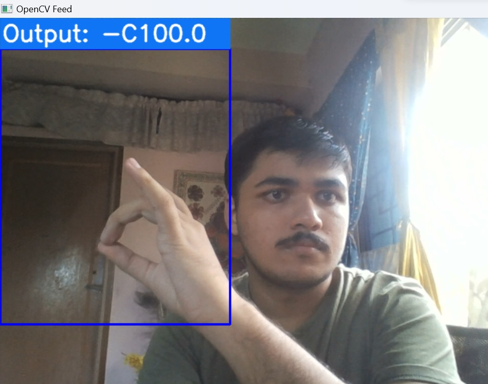

# Hand-Sign-Language- Detection-Using-ML


# Understanding the project

This Python Program Uses a Learning Model Where we can train it to capture data such as Alphabet of American Hand-Sign Language.

Using this I have already trained it with the Alplhabet from A-Z.

So when Running the Command in the Project directory:- 

 ```bash
  python app.py
  ```

  it will open the Device Camera & will Search for the Hand-Sign & will tell what alphabet it is.

  # Working Proof of the Project:-

  

  here as you can see it,s Detecting my hand which is showing the C alphabet.  

